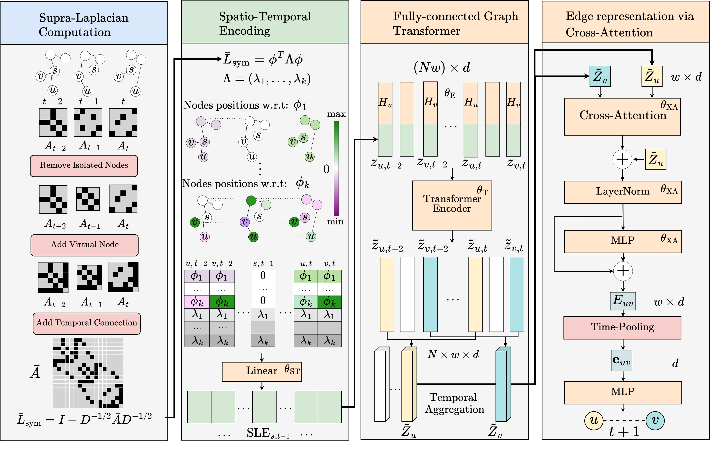

# SLATE Model (Under Review Neurips 2024 )

This is the official repository for the paper SLATE: Supra Laplacian Encoding for Transformer on Dynamic Graph.




## Installation
```
conda create -n SLATE python=3.9
conda activate SLATE
pip install -e .
```
Try : 
```
pip install -r requirements.txt
```
If you encounter a bug, please install at least the following packages in the following order:

```
torch==2.2.2+cu118
torch_geometric==2.4.0
torcheval==0.0.6
-----------------------------------
networkx==3.2.1
hydra-colorlog==1.2.0
hydra-core==1.3.2
pandas==1.3.5
```


## Code explaination


### Code structure and main files to review
The main files of interest are:

- `slate/lib/supra.py`: This file contains the code for transforming a discrete dynamic graph into a multilayer graph.

- `slate/models/slate.py`: This file details our SLATE model. Here you can see how the 4 steps of our model are performed (Supra-adjacency, construction of the spatio-temporal encoding, Fully-connected Transformer and Edgemodule cross-attention) as illustrated in the figure above.

- `slate/engine/engine_link_pred.py`: This is the main file where we load the models, datasets, train the model, and perform the evaluation.

- `slate/data`: Some of DTDG graph data used for the experiments.

- `scripts`: The example execution scripts are located in this folder.

### About Hydra: 
We use Hydra to execute scripts. Hydra overwrites the configuration files located in `slate/config/`. For example, the configuration file for the SLATE model is in `slate/config/model/SLATE.yaml`.

## Notebooks

### `notebooks/SLATE_Demo_toygraph.ipynb`
We have provided a demonstration of the SLATE model as well as the main operations:

- Transform a dynamic graph into a spatio-temporally connected multilayer graph.
- Show the projections of the eigenvectors forming the basis of our spatio-temporal encoding on the transformed multilayer graph.
- Demonstrate how to generate the token sequence as input for the transformer.
- (TODO) Show cross-attention between historical pair of nodes. 

### `notebooks/supralaplacian_visu.ipynb`

The visualizations from the rebuttal as well as the code used to generate them are in this notebook. You can find all the generated figures in `figures/`.

## Run experiments 
### Example : run SLATE on dataset UNtrade

Before running an experiment, it is necessary to go to the configuration file: `slate/config/dataset/UNtrade`.yaml and replace `datadir:YourAbsolute/Path/data` with your absolute path to the `data/` folder.

You can then launch the script:


```
sh scripts/slate_trade.sh 
```

## Citation 

```
@inproceedings{
karmim2024supralaplacian,
title={Supra-Laplacian Encoding for Transformer on Dynamic Graphs},
author={Yannis Karmim and Marc Lafon and Raphael Fournier-S'niehotta and Nicolas THOME},
booktitle={The Thirty-eighth Annual Conference on Neural Information Processing Systems},
year={2024},
url={https://openreview.net/forum?id=vP9qAzr2Gw}
}
```